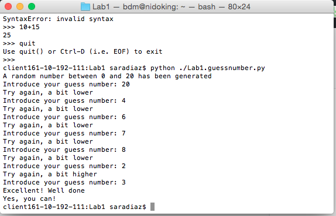
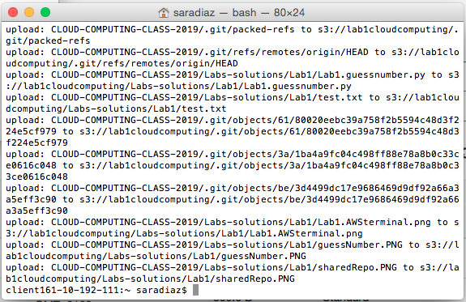

# Lab 1
### Fecha: 26/02/2019
### Names: Sara Díaz - Gabriela Martinez

## Execution of the guessnumber script 

## Synchronize S3 with repository 

## Conclusions
### How long have you been working on this session? 
We have been working on this lab for two hours
### What have been the main difficulties you have faced and how have you solved them? 
* How to upload a file from local to AWS from cmd
* How to synchronize S3 with a repo

